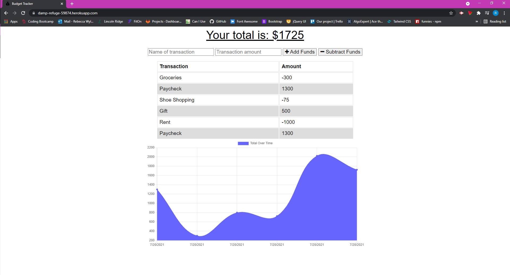

# Budget Tracker PWA
 
# Table of Contents
* [Description](#description)
* [Contributing](#contributing)
* [Tests](#tests)
* [Questions](#Questions)

## Description
This application has been updated to allow for offline access and functionality. It now uses IndexedDB and includes a service worker and web manifest.

### Screenshot

## Contributing
Made with ❤️ by Becca Wyland.

## Tests
No tests performed.

## Questions
For any questions regarding this app, please email rwyland@uwalumni.com or visit https://github.com/rwyland189.